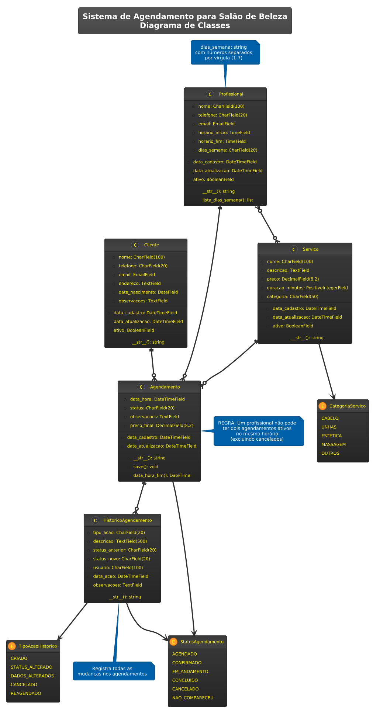

# Sistema de Agendamento para Salão de Beleza

Sistema web desenvolvido em Django para gerenciar agendamentos, clientes, profissionais e serviços de um salão de beleza.

## Funcionalidades

- **Gestão de Clientes**: Cadastro com dados pessoais e histórico
- **Profissionais**: Controle de especialidades e horários de trabalho
- **Serviços**: Catálogo com preços e categorias
- **Agendamentos**: Sistema com validação de conflitos e controle de status
- **Dashboard**: Estatísticas básicas e próximos agendamentos
- **Relatórios**: Serviços concluídos por período e performance

## Tecnologias

- **Backend**: Django 4.2 (Python 3.11+)
- **Banco**: SQLite com índices para performance
- **Frontend**: Bootstrap 5 + JavaScript
- **Containerização**: Docker
- **Automação**: Makefile

## Como executar

### Via Docker (recomendado)

```bash
# Ver comandos disponíveis
make help

# Construir e iniciar
make build && make up

# Verificar status
make status
```

### Execução local

```bash
# 1. Ambiente virtual
python -m venv venv
source venv/bin/activate

# 2. Dependências
pip install -r requirements.txt

# 3. Banco de dados
python manage.py migrate

# 4. Dados de exemplo
python manage.py populate_data

# 5. Executar
python manage.py runserver
```

**Acesso:**
- Sistema: http://localhost:8000
- Admin: http://localhost:8000/admin/ (admin/admin123)

## Comandos úteis (Makefile)

| Comando | Descrição |
|---------|-----------|
| `make up` | Inicia sistema completo com dados |
| `make down` | Para e remove container |
| `make logs` | Ver logs em tempo real |
| `make restart` | Reinicia o sistema |
| `make load-data` | Recarrega dados de exemplo |
| `make test` | Executa testes (auto-detecta ambiente) |
| `make test-coverage` | Executa testes com relatório de cobertura |
| `make format` | Formata código Python (isort + black + flake8) |

## Dados de demonstração

O comando `populate_data` cria:
- 10 serviços categorizados
- 6 profissionais com especialidades
- 20 clientes com dados brasileiros
- ~160 agendamentos distribuídos em 45 dias

## Desenvolvimento

### Testes
- **14 testes** automatizados cobrindo models, views e forms
- Execução via `make test` (detecta ambiente automaticamente)
- Relatório de cobertura com `make test-coverage` (gera HTML em `htmlcov/`)

### Qualidade de código
- Formatação automática com `make format` (isort + black + flake8)
- Ignora automaticamente erros de formatação irrelevantes
- Foco em problemas reais como imports não utilizados

## Melhorias futuras

- [ ] **API REST** para integração mobile
- [ ] **Notificações** por email/SMS 
- [ ] **Calendário** integrado
- [ ] **Pagamentos** online
- [ ] **Relatórios** mais completos, com inclusão de gráficos, dashboards e KPIs relevantes
- [ ] **Cobertura de testes** mais ampla

## Notas de desenvolvimento

Algumas melhorias identificadas durante o desenvolvimento:
- Validação de conflitos poderia considerar duração do serviço
- Expandir cobertura de testes para edge cases

## Diagrama de Classes

O sistema possui 5 modelos principais organizados da seguinte forma:

### Modelos Principais

1. **Cliente** - Dados pessoais e informações de contato
2. **Profissional** - Especialistas com horários de trabalho e especialidades
3. **Serviço** - Catálogo de serviços com preços e categorias
4. **Agendamento** - Agendamentos com status e controle de conflitos
5. **HistoricoAgendamento** - Auditoria de alterações nos agendamentos

### Relacionamentos

- **Cliente** ➜ **Agendamento** (1:N) - Um cliente pode ter vários agendamentos
- **Profissional** ➜ **Agendamento** (1:N) - Um profissional atende vários agendamentos  
- **Serviço** ➜ **Agendamento** (1:N) - Um serviço pode estar em vários agendamentos
- **Profissional** ↔ **Serviço** (N:N) - Profissionais têm especialidades em serviços
- **Agendamento** ➜ **HistoricoAgendamento** (1:N) - Cada agendamento mantém histórico

### Regras de Negócio

- ✅ **Constraint de unicidade**: Profissional não pode ter dois agendamentos no mesmo horário
- 🔄 **Auditoria completa**: Todas as alterações são registradas no histórico
- ⏰ **Duração padrão**: Todos os serviços têm 60 minutos de duração
- 📋 **Status workflow**: AGENDADO → CONFIRMADO → EM_ANDAMENTO → CONCLUIDO

### Diagrama de Classes



> 📋 **Diagrama completo**: Código fonte disponível em [`docs/class_diagram.puml`](docs/class_diagram.puml) (PlantUML)

## Estrutura do projeto

```
m2a-test/
├── appointments/             # App principal do Django
│   ├── models/
│   │   ├── __init__.py           # Imports dos modelos
│   │   ├── agendamento.py        # Model de Agendamento
│   │   ├── cliente.py            # Model de Cliente  
│   │   ├── profissional.py       # Model de Profissional
│   │   ├── servico.py            # Model de Serviço
│   │   └── historico.py          # Model de Histórico
│   ├── views/
│   │   ├── __init__.py           # Imports das views
│   │   ├── agendamentos.py       # Views de agendamentos
│   │   ├── clientes.py           # Views de clientes
│   │   ├── profissionais.py      # Views de profissionais
│   │   ├── servicos.py           # Views de serviços
│   │   ├── dashboard.py          # View do dashboard
│   │   ├── relatorios.py         # Views de relatórios
│   │   └── api.py                # Endpoints da API
│   ├── services/
│   │   ├── agendamento_service.py # Lógica de negócio para agendamentos
│   │   └── relatorio_service.py   # Lógica de negócio para relatórios
│   ├── management/
│   │   └── commands/
│   │       └── populate_data.py   # Comando para popular dados de teste
│   ├── migrations/               # Migrações do banco de dados
│   ├── forms.py                 # Formulários com validações
│   ├── admin.py                 # Interface administrativa
│   ├── urls.py                  # Roteamento de URLs
│   ├── apps.py                  # Configuração da app
│   └── tests.py                 # Testes (atualmente básico)
├── salon_management/         # Configurações do Django
│   ├── __init__.py
│   ├── settings.py              # Configurações gerais
│   ├── urls.py                  # URLs principais
│   ├── wsgi.py                  # Configuração WSGI
│   └── asgi.py                  # Configuração ASGI
├── templates/                # Templates HTML
│   ├── base.html                # Template base
│   └── appointments/            # Templates específicos
├── static/                   # Arquivos estáticos
│   ├── css/                     # Folhas de estilo
│   └── js/                      # Scripts JavaScript
├── venv/                     # Ambiente virtual Python
├── manage.py                 # Script de gerenciamento Django
├── requirements.txt          # Dependências Python
├── Dockerfile               # Configuração Docker
├── .dockerignore            # Arquivos ignorados pelo Docker
├── Makefile                 # Comandos de automação
├── README.md                # Documentação do projeto
├── .gitignore               # Arquivos ignorados pelo Git
└── db.sqlite3               # Banco de dados SQLite
```


